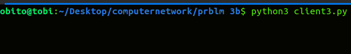
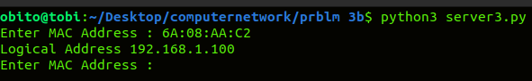

# IMPLEMENTATION OF REVERSE ADDRESS RESOLUTION PROTOCOL(RARP)

# EXP: 5

# DATE:06-04-2023

# AIM:
To write a python program for implementing  Reverse Address Resolution Protocol(RARP).

# ALGORITHM:
## Client:
1. Start the program
2. Using datagram sockets UDP function is established.
3. Get the MAC address to be converted into IP address.
4. Send this MAC address to server.
5. Server returns the IP address to client.
## Server:
1. Start the program.
2. Server maintains the table in which IP and corresponding MAC addresses are stored.
3. Read the MAC address which is send by the client.
4. Map the IP address with its MAC address and return the IP address to client.
# PROGRAM:
## CLIENT:
```python3
import socket
s = socket.socket()
s.bind(("localhost", 8000))
s.listen(5)
c, addr = s.accept()
address={"6A:08:AA:C2":"165.165.80.80","8A:BC:E3:FA":"165.165.79.1"};
while True:
   ip=c.recv(1024).decode()
   try:
       c.send(address[ip].encode())
   except KeyError:
       c.send("Not found".encode())

  ```
## SERVER:
```python3
import socket
s=socket.socket()
s.connect(("localhost", 8000))
while True:
    ip=input("Enter the MAC address:")
     
    s.send(ip.encode())
    print("logical Address",s.recv(1024).decode())


```
   
# CLIENT OUTPUT : 


# SERVER OUTPUT :



# RESULT:
Thus, the python program for simulating RARP protocols using TCP was successfully
executed.

